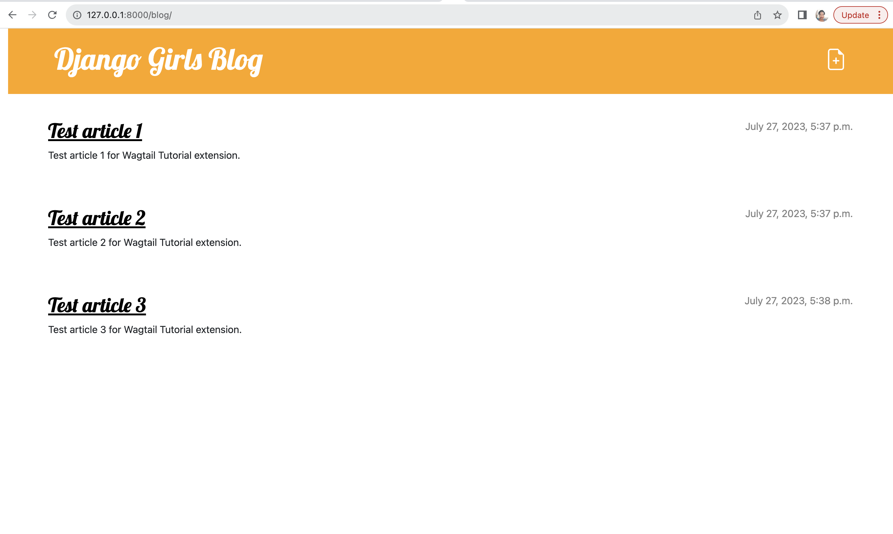

# Change Website Homepage to Wagtail Blog Homepage

The Wagtail admin has a nicer and a more user-friendly interface compared to the default Django admin user interface. 
For this reason, we would rather use our Wagtail blog as our main blog and ignore the blog we created in the main 
tutorial. 

We will not remove our initial blog, we will leave it as it is as we may need to use it for more learning. We will
however change the root of our project to point to our Wagtail blog. Make the following changes to your 
`mysite/urls.py` as shown below:

First change the   `URL` for your first blog to the following:

```python
path('blog/', include('blog.urls')),
```

Next change the `URL` for the Wagtail blog to the following:

```python
path('', include(wagtail_urls)),
```

Your `mysite/urls.py` should now look like below:

 mysite/urls.py 
```python
from django.conf import settings
from django.conf.urls.static import static
from django.contrib import admin
from django.urls import include, path

from wagtail.admin import urls as wagtailadmin_urls
from wagtail import urls as wagtail_urls

urlpatterns = [
    path('admin/', admin.site.urls),
    path('blog/', include('blog.urls')),
    path('cms/', include(wagtailadmin_urls)),
    path('', include(wagtail_urls)),
] + static(settings.MEDIA_URL, document_root=settings.MEDIA_ROOT)

```

This will make your Wagtail accessible by visiting `http://127.0.0.1:8000` as shown below


and your first blog will now be at `http://127.0.0.1:8000/blog/` as shown below.



That's all for this tutorial. If you want to learn more about Wagtail, you can read the 
[Wagtail documentation](https://docs.wagtail.org/en/stable/) or search for more tutorials on Wagtail online.

Happy coding!
