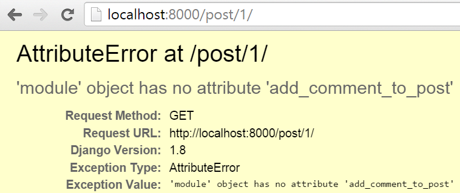

# 숙제 : 댓글 모델 만들기 

지금까지 Post 모델만 있었죠. 독자들에게 피드백과 코멘트를 받을 수 있는 댓글을 만들어보면 어떨까요?

## Comment 모델 만들기

`blog/models.py` 파일을 열어, 파일의 맨 마지막에 아래 코드를 추가해주세요.

```python
class Comment(models.Model):
    post = models.ForeignKey('blog.Post', on_delete=models.CASCADE, related_name='comments')
    author = models.CharField(max_length=200)
    text = models.TextField()
    created_date = models.DateTimeField(default=timezone.now)
    approved_comment = models.BooleanField(default=False)

    def approve(self):
        self.approved_comment = True
        self.save()

    def __str__(self):
        return self.text
```


각 필드 타입들에 대한 설명은 장고걸스 튜토리얼의 **[Django 모델](https://tutorial.djangogirls.org/ko/django_models/)** 장에서 다뤘으니 다시 읽고 돌아와도 좋아요.

이번 장에서는 새로운 필드 타입을 써볼게요.

- models.BooleanField - 참/거짓(true/false) 필드랍니다.

`models.ForeignKey`의 `related_name` 옵션은 Post 모델에서 댓글에 액서스할 수 있게 합니다.

## 데이터베이스에 새 모델 테이블 생성하기

자, 데이터베이스에 Comment 모델을 추가할 시간이에요. 그러려면 장고에게 모델 변경내용을 알려줘야 합니다. `python manage.py makemigrations blog` 명령어를 입력하세요.

```
    (myvenv) ~/djangogirls$ python manage.py makemigrations blog
    Migrations for 'blog':
      0002_comment.py:
        - Create model Comment
```

`blog/migrations` 디렉터리에 새로 마이그레이션 파일이 생성되었어요. 이제 `python manage.py migrate blog` 명령어로 변경내역을 적용합니다. 다음과 같은 출력이 보일 거예요.

```
    (myvenv) ~/djangogirls$ python manage.py migrate blog
    Operations to perform:
      Apply all migrations: blog
    Running migrations:
      Rendering model states... DONE
      Applying blog.0002_comment... OK
```

이제 Comment 모델이 데이터베이스 안에 생겼네요! 관리자 패널(admin panel)에서 Commnet 모델에 접근할 수 있다면 멋지겠죠?

## 관리자 패널에 Comment 모델 등록하기

관리자 패널에 모델을 등록하기 위해, `blog/admin.py`로 가서 아래 코드를 추가해주세요.


```python
admin.site.register(Comment)
```

아래 코드 바로 밑에 추가하면 됩니다.

```python
admin.site.register(Post)
```

파일 맨 처음에 Comment 모델을 import 하는 것을 잊지 마세요. 소스파일은 아래와 같은 내용이어야 합니다.

```python
from django.contrib import admin
from .models import Post, Comment

admin.site.register(Post)
admin.site.register(Comment)
```

커맨드 라인에서 `python manage.py runserver`를 입력하고 브라우저에서 [http://127.0.0.1:8000/admin/](http://127.0.0.1:8000/admin/)를 열어보세요. Comment 리스트가 보이고, 댓글을 추가 삭제할 수 있을 거예요. 주저하지 말고 댓글을 가지고 놀아보세요.

## 댓글 보여주기

`blog/templates/blog/post_detail.html`로 가서 `` 태그 바로 전에 아래 코드를 추가하세요.

```django
<hr>

    <div class="comment">
        <div class="date">{{ comment.created_date }}</div>
        <strong>{{ comment.author }}</strong>
        <p>{{ comment.text|linebreaks }}</p>
    </div>

    <p>No comments here yet :(</p>

```

자 이제 post_detail 페이지의 댓글을 읽을 수 있어요.


좀 더 이쁘게 보이면 좋겠어요. `static/css/blog.css`파일을 열어 `css` 코드를 추가해보세요.


```css
.comment {
    margin: 20px 0px 20px 20px;
}
```

post_list 페이지에서 각 글마다 달린 댓글 개수도 보여줍시다. `blog/templates/blog/post_list.html`에 아래 코드를 추가해주세요.

```django
<a href="">Comments: {{ post.comments.count }}</a>
```

이제 아래와 같은 코드가 될 거에요.

```django



    
        <div class="post">
            <div class="date">
                {{ post.published_date }}
            </div>
            <h1><a href="">{{ post.title }}</a></h1>
            <p>{{ post.text|linebreaksbr }}</p>
            <a href="">Comments: {{ post.comments.count }}</a>
        </div>
    

```

## 댓글 작성하기

방문자는 댓글을 읽을 수 있지만, 직접 댓글을 남길 수는 없어요. 댓글을 작성할 수 있게 만들어 봅시다.


`blog/forms.py`파일의 맨 끝에 아래 코드를 추가하세요.

```python
class CommentForm(forms.ModelForm):

    class Meta:
        model = Comment
        fields = ('author', 'text',)
```

파일 맨 처음에 Comment 모델을 import 하는 것을 잊지 마세요. 

아래 코드를 찾아
  
```python
from .models import Post
```

이렇게 수정하세요.
```python
from .models import Post, Comment
```

다음으로 `blog/templates/blog/post_detail.html` 파일에서 `` 전에 아래 코드를 추가해주세요.

```django
<a class="btn btn-default" href="">Add comment</a>
```

post_detail 페이지로 가면 에러가 뜰 거에요.


어떻게 고쳐야하는지 알고 있을 거에요! `blog/urls.py` 파일에서 `urlpatterns`에 새 패턴을 추가해야죠.

```python
url(r'^post/(?P<pk>\d+)/comment/$', views.add_comment_to_post, name='add_comment_to_post'),
```

페이지를 새로고침하면 또 에러가 보일 거에요!



에러를 해결하려면 `blog/views.py` 파일에서 새로운 뷰를 추가해야해요.

```python
def add_comment_to_post(request, pk):
    post = get_object_or_404(Post, pk=pk)
    if request.method == "POST":
        form = CommentForm(request.POST)
        if form.is_valid():
            comment = form.save(commit=False)
            comment.post = post
            comment.save()
            return redirect('post_detail', pk=post.pk)
    else:
        form = CommentForm()
    return render(request, 'blog/add_comment_to_post.html', {'form': form})
```

이번에도 파일 맨 처음에  `CommentForm` 을 import 하는 것을 잊지 마세요.

```python
from .forms import PostForm, CommentForm
```

이제 post_detail 페이지로 가보면, "Add comment" 버튼을 확인할 수 있을 거에요.


하지만, 버튼을 끌릭하면 이런 게 보이겠죠.


이 에러는 뷰에서 지정된 템플릿이 없다는 에러에요. `blog/templates/blog/` 경로에 `add_comment_to_post.html`이라는 새 파일을 만들고 아래 코드를 작성하세요.

```django



    <h1>New comment</h1>
    <form method="POST" class="post-form">
        {{ form.as_p }}
        <button type="submit" class="save btn btn-default">Send</button>
    </form>

```

와! 이제 내 블로그 글을 읽은 사람들이 댓글을 남길 수 있게 되었네요!

## 댓글 관리하기

현재 블로그에 남겨진 모든 댓글들이 post_detail 페이지에 보이네요. 블로그 관리자가 댓글을 승인하거나 삭제할 수 있는 기능이 필요하겠죠. 이제 이 기능을 만들어 봅시다.

`blog/templates/blog/post_detail.html` 파일에서 아래 코드를 찾아

```django

    <div class="comment">
        <div class="date">{{ comment.created_date }}</div>
        <strong>{{ comment.author }}</strong>
        <p>{{ comment.text|linebreaks }}</p>
    </div>

    <p>No comments here yet :(</p>

```

이렇게 바꾸세요.

```django

    
    <div class="comment">
        <div class="date">
            {{ comment.created_date }}
            
                <a class="btn btn-default" href=""><span class="glyphicon glyphicon-remove"></span></a>
                <a class="btn btn-default" href=""><span class="glyphicon glyphicon-ok"></span></a>
            
        </div>
        <strong>{{ comment.author }}</strong>
        <p>{{ comment.text|linebreaks }}</p>
    </div>
    

    <p>No comments here yet :(</p>

```

`NoReverseMatch` 예외가 뜰 텐데요. 이를 `comment_remove`와 `comment_approve` 패턴에 매칭되는 url이 없기 때문이에요.

에러를 해결하려면 `blog/urls.py` 에 `url` 패턴을 추가해주세요.

```python
url(r'^comment/(?P<pk>\d+)/approve/$', views.comment_approve, name='comment_approve'),
url(r'^comment/(?P<pk>\d+)/remove/$', views.comment_remove, name='comment_remove'),
```

이제 `AttributeError` 에러가 또 보일 거에요. 에러를 해결하기 위해, `blog/views.py` 에 뷰를 추가해주세요.

```python
@login_required
def comment_approve(request, pk):
    comment = get_object_or_404(Comment, pk=pk)
    comment.approve()
    return redirect('post_detail', pk=comment.post.pk)

@login_required
def comment_remove(request, pk):
    comment = get_object_or_404(Comment, pk=pk)
    comment.delete()
    return redirect('post_detail', pk=comment.post.pk)
```

파일 맨 처음에 `Comment`를 import하는 것을 잊지 않았겠죠.

```python
from .models import Post, Comment
```

모든 것이 잘 작동되네요! 하지만 마지막 한 가지가 남았어요. 현재 post_list 페이지에서는 등록된 모든 댓글의 개수가 보이는데요. *승인된* 댓글의 개수만 보이게 수정해봅시다.
                   
`blog/templates/blog/post_list.html`파일에서 아래 코드를

```django
<a href="">Comments: {{ post.comments.count }}</a>
```

다음과 같이 수정해주세요.

```django
<a href="">Comments: {{ post.approved_comments.count }}</a>
```

그리고 `blog/models.py` 파일에서 `Post` 모델에 아래 메서드를 추가해주세요.

```python
def approved_comments(self):
    return self.comments.filter(approved_comment=True)
```

드디어 댓글 기능을 모두 만들었어요! 함께 축하해요. :-)

